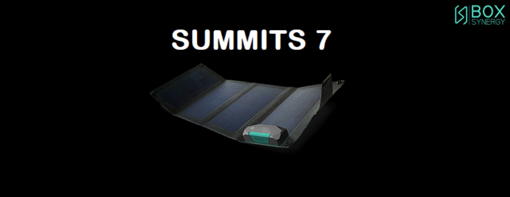
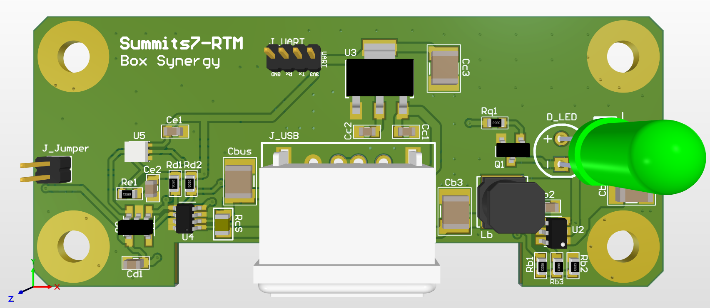

# Diseño en ALTIUM del PCB del Summits 7 - Versión RTM 1.0

## PCB Summits 7 - Versión RTM 1.0

## ¿Para que es este repositorio? 

 - Este repositorio servirá para tener un **Control de Versiones**, **Acceso Remoto al developer** y **Permitir Acceso continuo de avances** al equipo de trabajo de *Box Synergy*.

## ¿Como funciona este repositorio?

Este repositorio tiene dos Branches (o Ramas):

* **master:** Contiene la última versión estable, es decir después de cumplir un objetivo en el diseño y se compruebe que fue estable, se hace un salvado de datos en esta rama. Para consultar avances es preferible mirar esta rama ya que es la más estable.
* **develop:** Contiene la versión que está en desarrollo, por lo tanto probablemente inestable y con errores naturales durante el proceso de desarrollo. Esta rama es la utilizada por el desarrollador y por algún colaborador que quiera mirar o ayudar en pleno desarrollo.

## ¿Como puedo consultar el proyecto?
1. Si no lo tiene, instalar cualquier versión de Altium Designer en su PC.
2. Posicionese en el **BRANCH** (o rama) que usted desee descargar. Para seleccionar el branch haga click en el menú desplegable que está debajo del título del Repositorio (mas específicamente debajo de la descripción del repositorio) y elija el Branch que usted desee.
3. Descargar este repositorio desde un botón con tres puntos **(...)** que se encuentra en la esquina superior derecha del repositorio (al lado del botón *Clone*), luego seleccione ***Download Repository***. Se descargará un archivo comprimido *.zip*.
4. Descomprima la carpeta del Repositorio en alguna carpeta conocida.
5. Abra Altium y seleccione el proyecto que acaba de descomprimir.

## Consultas
- electronic@box-synergy.com	---  Contacto Área Electrónica de Box Synergy
- gustavobelbruno@gmail.com		---  Contacto Gustavo Belbruno - Summits 7 Beta Project Main Designer

																					Repository created 05/04/2020